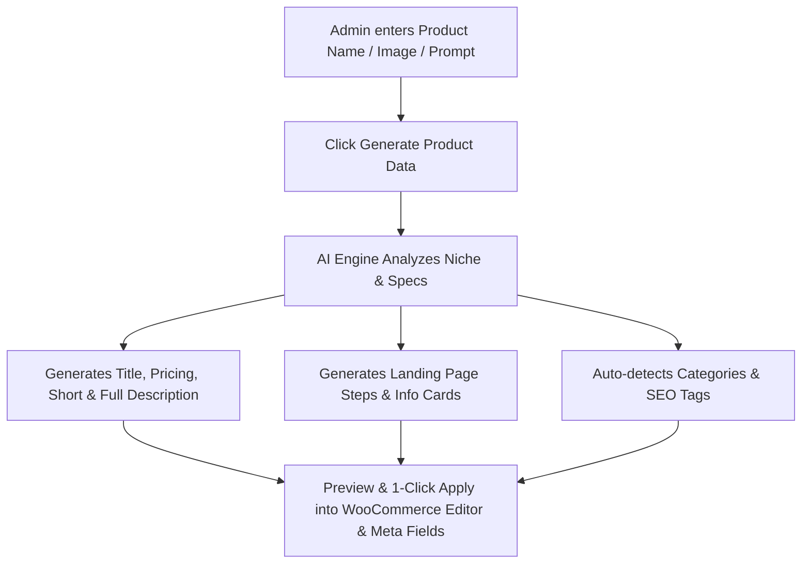

# AI Product Data & Landing Page Generator (AI প্রডাক্ট ডাটা ও ল্যান্ডিং পেজ জেনারেটর)

A smart AI-powered content generation assistant integrated into WooCommerce Add New Product and Edit Product pages. It automatically writes high-converting sales copies, descriptions, pricing, usage steps, info cards, SEO meta, and auto-selects categories.

## User Review Required

> [!IMPORTANT]
> The AI Generator will feature both **Google Gemini AI API Integration** (for real-time deep generation) and a **Smart Built-in Offline Fallback Engine** so it works smoothly even if no external API key is configured.

## Workflow & Features

### 1. Interactive Generator Modal on Product Add/Edit Page
- **Button:** Gradient **"✨ Generate Product Data with AI"** button placed near the Product Title and in the Sidebar.
- **Input Fields:**
  - Product Sample Title / Name (শুধু নাম দিলেও চলবে).
  - Product Image Picker (WordPress Media Library integration).
  - Optional Rough Specs / Description / Price.
  - Custom Prompt (যেমন: অফার ও ওয়ারেন্টির ওপর জোর দাও).
  - Tone: High-converting Bangla eCommerce Copy.

### 2. Auto-Populated Product & Landing Page Fields
- **WordPress/WooCommerce Fields:**
  - `#title` -> Engaging Product Title
  - `#content` (TinyMCE/Gutenberg) -> Rich HTML Sales Page Description
  - `#excerpt` -> High-impact Short Description & Key Highlights
  - `#_regular_price` & `#_sale_price` -> Strategic Pricing
  - `#product_catchecklist` -> Auto-checks best matching product category
- **Landing Page Data (`inc/product-meta.php` integration):**
  - Section 1: ব্যবহারের নিয়মাবলী (`_fmb_steps_title` + `_fmb_usage_steps` array)
  - Section 2: কেন এটি সেরা? ইনফো কার্ড (`_fmb_cards_title` + `_fmb_info_cards` array)
- **SEO Optimization:**
  - SEO Meta Title, Meta Description & Keywords.

---

## Proposed Changes

### Core AI Engine
#### [NEW] [ai-product-generator.php](file:///d:/FMB/FMB-Theme/fmb-ecom-store1.3.0/inc/ai-product-generator.php)
- Backend class `FMB_AI_Product_Generator`.
- AJAX endpoints for generating AI product content via Gemini API or fallback rules.
- Settings for saving optional Gemini API Key.
- Enqueuing admin scripts & modal styles on `post-new.php?post_type=product` and `post.php?post=XXX&action=edit`.

### Theme Inclusion
#### [MODIFY] [functions.php](file:///d:/FMB/FMB-Theme/fmb-ecom-store1.3.0/functions.php)
- Include `inc/ai-product-generator.php`.

---

## Verification Plan

### Automated & Manual Verification
1. Open WooCommerce Add New Product (`wp-admin/post-new.php?post_type=product`).
2. Click **"✨ Generate Product Data with AI"**.
3. Type only a product name (e.g. `Air Fryer 6L`) and click **Generate**.
4. Verify that:
   - Optimized Title, Regular Price, Sale Price, Short & Long Descriptions are generated.
   - Landing Page Steps (ব্যবহারের নিয়মাবলী) and Info Cards (কেন এটি সেরা) are created.
   - Matching category is identified.
5. Click **"Apply to Product"** and verify all input boxes, TinyMCE editor, prices, and landing page repeater fields are populated in 1 click!
